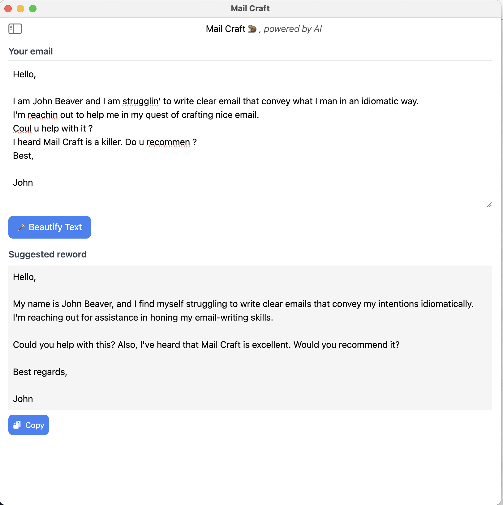

# Mail Craft

Mail Craft is a desktop app that helps to **write better emails** leveraging LLM models.

## Current models supported

- OpenAI GPT 4 (gpt-4-1106-preview)
- OpenAI GPT 3.5 (gpt-3.5-turbo-1106)
- MistralAI tiny

## Technology

- [Electron JS](http://electronjs.org/)
- [Tailwind CSS](http://tailwindcss.com)

## Development

Contributions are welcome. 

**Installation**
```bash
npm install
```

Rebuild sqlite3 using `electron-rebuild`:
```bash
./node_modules/.bin/electron-rebuild -f -w sqlite3
```

**Run the app**

```bash
npm start
```

**Build**

Compile CSS
```bash
npx tailwindcss -i ./src/index.css -o ./dist/output.css
```

Build the app:
```bash
npm run make
```

## Screenshots


