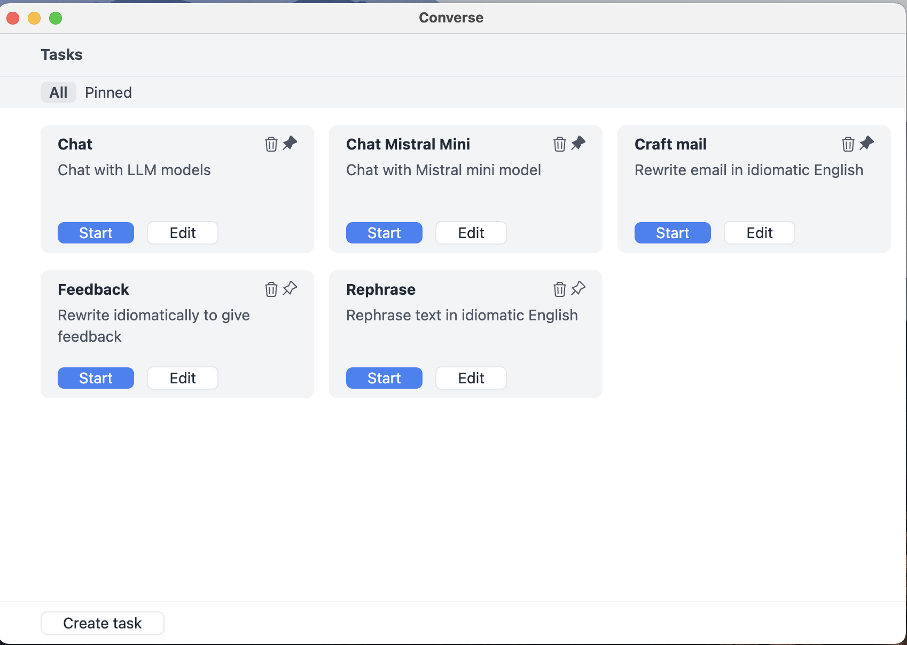
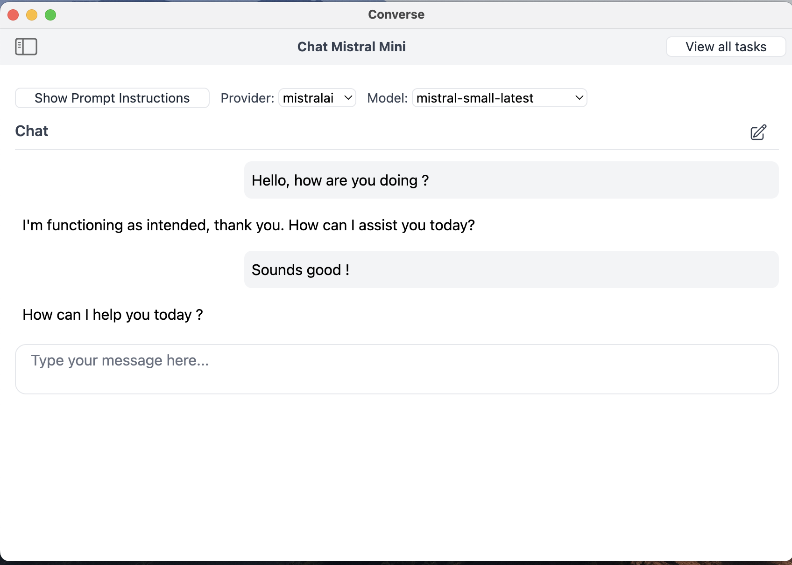
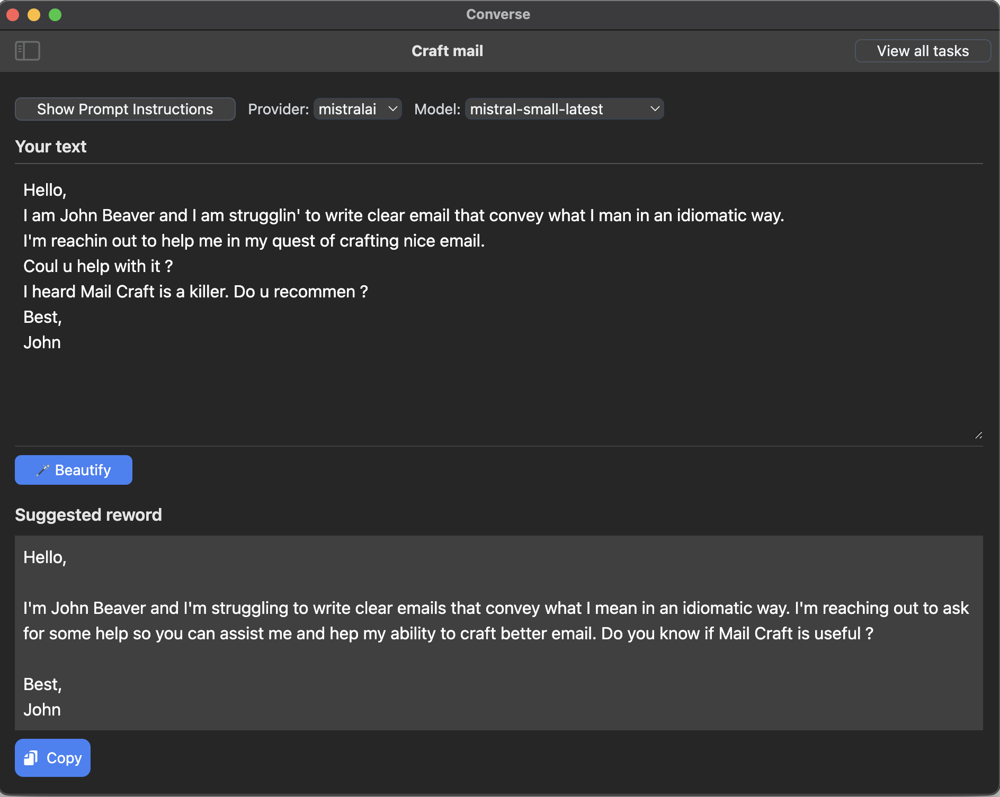

# Converse

Converse is a desktop app to chat and create tasks with various LLMs models.

## Current models supported

- OpenAI
- Mistral
- Anthropic

## Technology

- [Electron JS](http://electronjs.org/)
- [Tailwind CSS](http://tailwindcss.com)

## Development

Contributions are welcome. 

**Installation**
```bash
npm install
```

Rebuild sqlite3 using `electron-rebuild`:
```bash
./node_modules/.bin/electron-rebuild -f -w sqlite3
```

**Run the app**

```bash
npm start
```

**Build**

Compile CSS
```bash
npx @tailwindcss/cli -i ./src/renderer/css/index.css -o ./public/output.css
```

Build the app:
```bash
npm run app:dist
```

## Screenshots




